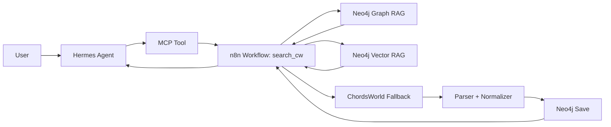

# AI Chord Neo4j Agent

AI agent for chord retrieval and song structure search using Hermes, MCP, n8n, and Neo4j graph/vector RAG.

## Overview

This project is a bounded AI agent system for retrieving chord and song-structure data.

The system helps a user:

- search for a song by title, artist, or ChordsWorld URL
- retrieve existing chord data from Neo4j
- ingest missing songs through an n8n workflow
- return a clean chord overview with title, artist, capo, and sections

The project is built as a final course prototype and focuses on meaningful integration of:

- Hermes Agent
- MCP
- n8n
- Neo4j graph RAG
- Neo4j vector RAG

## Use Case

Chord information on the web is often fragmented, inconsistent, and difficult to reuse across workflows.

This project addresses that by combining:

- an AI agent interface
- workflow-based retrieval and ingestion
- graph-based storage of song structure
- semantic retrieval over stored project data

The result is an agent that can retrieve or ingest chord data and present it in a structured format.

## Core Flow

1. A user sends a query to Hermes.
2. Hermes calls an MCP-exposed tool.
3. The tool triggers the `search_cw` workflow in n8n.
4. The workflow first looks for the song in Neo4j.
5. If the song exists, it returns the stored result.
6. If the song is missing, the workflow searches ChordsWorld, parses the song page, stores the result in Neo4j, and returns a formatted response.

## Architecture



## Main Components

### Hermes Agent

Hermes is the primary user-facing interface and orchestration layer.

### MCP

MCP exposes at least one workflow as a callable tool so the agent can use it directly.

### n8n

n8n runs the main retrieval and ingestion workflow.

### Neo4j Graph RAG

Neo4j stores structured relationships such as songs, artists, and sections.

### Neo4j Vector RAG

Neo4j also supports semantic retrieval over stored content.

## Main Workflow

The main workflow is:

- `search_cw`

Its responsibilities are:

- normalize the incoming query
- search Neo4j first
- fall back to ChordsWorld if needed
- parse title, artist, capo, and chord sections
- save the result to Neo4j
- return a formatted response

## Example Output

The system returns a readable result such as:

```text
Yellow
Coldplay
Capo: 4

Intro
| G | D | C | G |

Verse I
| G | D | C | G |
```

## Current Status

The prototype currently supports:

- stored-song retrieval
- fallback ingestion from ChordsWorld
- structured Neo4j storage
- graph-based retrieval
- vector-based retrieval

The current priority is stability and demonstrability for the final project hand-in.

## Limitations

- web ingestion can still produce noisy records in edge cases
- parsing is tuned for practical use, not perfect coverage
- the current dataset is small and bounded for prototype purposes
- the project prioritizes a reliable agent workflow over broad source coverage

## Repository Structure

```text
.
├── README.md
├── docs/
│   └── demo-notes.md
├── n8n/
│   └── README.md
├── prompts/
│   └── search-cw-system-prompt.md
└── notes/
    ├── project-mvp-plan.md
    └── project-package.md
```

## Course Context

This project was developed as a final project prototype for a course on AI agents.

The prototype demonstrates how agents, tools, workflows, graph retrieval, and vector retrieval can be combined in a realistic and bounded use case.
