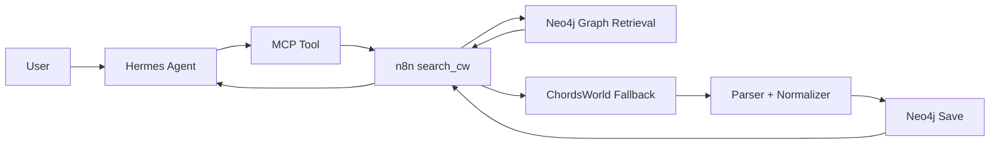

# AI Guitar Song Retrieval Agent MVP

## Project Goal

Build a bounded AI agent system for guitar-song retrieval and chord assistance.

The system should help a user:

- request a song by title, artist, or ChordsWorld URL
- retrieve chord data from Neo4j if it already exists
- automatically fall back to ChordsWorld if the song is missing
- parse and store the song in Neo4j
- return a readable chord overview to the user

The system must clearly demonstrate:

- Hermes Agent
- MCP
- n8n
- Neo4j graph RAG
- Neo4j vector RAG

## Locked MVP

The MVP supports one main user task:

`Find chords for a song and return a structured song overview.`

Example prompts:

- `Find chords for Wonderwall`
- `Get me Taylor Swift Blank Space chords`
- `Here is the ChordsWorld URL: ...`

## What Already Exists

### Existing workflow used for MVP

- `search_cw`

This workflow already handles the main end-to-end behavior:

1. receive the full user query
2. search Neo4j first
3. if found, return the stored song
4. if not found, search ChordsWorld
5. extract the best candidate song page
6. parse chords, sections, capo, title, and artist
7. save the parsed song to Neo4j
8. return a formatted song response

### Existing agent workflow

- `Neo4j two-week Retrieval AI-agent`

This workflow acts as an n8n AI agent and calls `search_cw` as a tool.

### Workflow no longer needed in MVP

- `ingest_cw_song`

This appears redundant for the MVP because `search_cw` already includes ingestion behavior.

## Current Architecture

## Meaningful Use Of Required Components

### Hermes Agent

Hermes is the user-facing agent that receives the request and calls tools.

### MCP

MCP is the tool interface between Hermes and the workflow layer.

For the MVP, the main MCP-exposed tool should be conceptually:

- `search_cw(query)`

Hermes passes the full user query to the tool.

### n8n

n8n runs the actual workflow logic:

- Neo4j lookup
- fallback search
- parsing
- saving
- formatting response

### Neo4j Graph RAG

Graph retrieval is already present through structured Neo4j traversal.

Current graph entities include:

- `Song`
- `Artist`
- `Section`

Current graph relationships include:

- `(:Song)-[:BY_ARTIST]->(:Artist)`
- `(:Song)-[:HAS_SECTION]->(:Section)`

This is sufficient to justify graph-based retrieval in the MVP.

### Neo4j Vector RAG

Neo4j vector RAG already exists in the project.

For the MVP, the important task is not to build it from scratch, but to make its role explicit in:

- the architecture diagram
- the agent flow
- the demo scenarios
- the report

The vector layer should be described as semantic retrieval over stored song text, summaries, parsed content, or related chord context.

Examples of vector-oriented prompts:

- `Find a song with easy chords`
- `Find a capo-friendly version`
- `Find songs similar in chord feel`

## Main MVP Workflow: `search_cw`

## Input

- full user message as `query`

## Output

- found/not found
- title
- artist
- URL
- capo
- sections
- formatted plain-text response

## Internal Flow Summary

1. Normalize the incoming query.
2. Query Neo4j for an existing song match.
3. Build a context object if found.
4. Format a clean response immediately if found.
5. If not found, search ChordsWorld through DuckDuckGo.
6. Identify the best ChordsWorld candidate URL.
7. Download the page.
8. Extract raw song data.
9. Parse title, artist, capo, sections, and chords.
10. Prepare a normalized Neo4j payload.
11. Save the song in Neo4j.
12. Return a formatted result to the user.

## Why This Is A Good MVP

- It is bounded.
- It already works mostly end-to-end.
- It demonstrates real retrieval and fallback behavior.
- It uses n8n meaningfully.
- It uses Neo4j meaningfully.
- It can be explained clearly in the report and oral exam.

## What To Skip

Do not spend time now on:

- Discord as the primary interface
- multiple agents
- broad scraping across many websites
- perfect chord ranking
- large preference systems
- advanced UX polishing

## Minimum Remaining Work

### 1. Make MCP explicit

You need to be able to say and show that Hermes calls the workflow through an MCP-exposed tool.

Even if the underlying logic already exists in n8n, the MCP boundary must be visible in the architecture and demo.

### 2. Make vector RAG visible in the agent flow

This is now mainly a documentation and demo task.

You need to be able to show:

- what text is embedded
- how Neo4j vector retrieval is triggered
- how the retrieved context is used in the agent response
- at least one prompt where semantic retrieval matters

### 3. Prepare three reliable demo queries

Suggested demo cases:

1. song already exists in Neo4j
2. song missing and gets ingested from ChordsWorld
3. semantic retrieval using vector search

## Recommended Final Framing

Project title:

`AI Guitar Song Retrieval Agent`

Short description:

`A bounded AI agent system that retrieves guitar chord data for songs, stores structured song knowledge in Neo4j, ingests missing songs from ChordsWorld through n8n workflows, and exposes the functionality to Hermes through MCP.`

## Immediate Next Task

Document exactly where vector RAG is used in the current workflow stack and make sure one demo query depends on it clearly.
