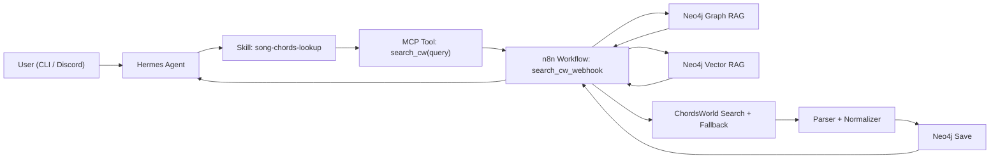

# AI Guitar Song Retrieval Agent

## Problem Formulation

This project builds a bounded AI agent system that helps a guitarist retrieve song chords in a structured and practical way.

The main problem is that chord information on the web is fragmented, inconsistent, and often difficult to reuse in a personalized workflow. Chord pages may be noisy, incomplete, or hard to search across songs, artists, capo information, and song structure. A guitarist therefore needs a system that can retrieve existing structured song data, ingest missing songs when necessary, and return usable results through a natural AI interface.

The goal of the system is to let a user ask for a song by title and artist and receive a clean song overview with artist, capo, sections, and chord lines. The system uses Hermes Agent as the user-facing agent, MCP as the tool interface, n8n as the workflow engine, Neo4j graph RAG for structured song relationships, and Neo4j vector RAG for semantic retrieval over stored song content.

## Use Case

The chosen use case is a guitar-song retrieval assistant.

The user can:

- ask for chords for a known song
- retrieve a previously stored song from Neo4j
- trigger fallback ingestion when the song is missing
- receive a structured chord overview with sections and capo
- interact through Hermes in both CLI and Discord

This is a relevant and bounded use case because it solves a real retrieval problem and uses agents, workflows, tools, graph data, and vector search in a meaningful way.

## Requirements

### Functional Requirements

1. The system must support song retrieval based on a user query.
2. The system must return structured song information including title, artist, capo, and chord sections.
3. The system must search existing project data in Neo4j before using external fallback.
4. The system must ingest and store missing songs from ChordsWorld through an n8n workflow.
5. The system must expose at least one workflow through an MCP-accessible tool so the agent can call it.
6. The system must use Neo4j graph RAG to model and retrieve relationships between songs, artists, and sections.
7. The system must use Neo4j vector RAG to retrieve semantically relevant song content or project data.
8. The system must support user interaction through a reasonable interface, implemented here as Hermes CLI and Discord DM.

### Non-Functional Requirements

1. The system must be bounded enough to be implemented as a working prototype.
2. The system must produce readable results for demo and oral presentation.
3. The system should tolerate incomplete or noisy web data.
4. The system should prioritize stable demo behavior over broad feature scope.

## Architecture

### High-Level Description

The user interacts with Hermes Agent either in the terminal or through Discord. Hermes uses a custom skill and an MCP-exposed tool that calls an n8n workflow through a direct webhook. The main workflow is `search_cw_webhook`. It first queries Neo4j for an existing matching song. If the song already exists, it returns the stored result. If not, it falls back to ChordsWorld search, parses the selected song page, stores the result in Neo4j, and returns a formatted chord overview.

Neo4j is used in two ways:

- graph RAG for structured retrieval of songs, artists, and sections
- vector RAG for semantic retrieval over stored song text and summaries

### Architecture Summary

- `Discord / CLI`
  User-facing interfaces
- `Hermes Agent`
  Agent orchestration and response generation
- `Hermes skill: song-chords-lookup`
  Prompting and tool-use behavior for music queries
- `MCP server`
  Tool boundary between Hermes and the workflow layer
- `n8n search_cw_webhook`
  Main retrieval and ingestion workflow
- `Neo4j graph RAG`
  Structured lookup of songs, artists, and sections
- `Neo4j vector RAG`
  Semantic retrieval over stored song content
- `ChordsWorld fallback`
  External source used when the song is missing

### Mermaid Diagram

## Justification Of Platform And Model

Hermes Agent was chosen because it is one of the required platforms and provides a practical agent interface for tool use, MCP integration, and multi-platform interaction. It made it possible to expose the workflow as a tool instead of hard-coding all logic inside a single application script.

The current model setup uses GitHub Copilot with `gpt-5.3-codex` in Hermes. This model was selected because it worked reliably in the current Hermes setup, while earlier attempts with other model names or unsupported Copilot combinations were less stable in practice. The final choice is therefore pragmatic: it prioritizes compatibility, stable tool use, and predictable behavior over maximum theoretical capability.

This matters in relation to capability and cost:

- larger or newer models may offer stronger reasoning
- but compatibility and operational stability matter in a working prototype
- a supported and reliable model is more valuable here than a theoretically stronger model that fails in the chosen platform

## Student-Created Prompt / Skill

The project includes a student-modified Hermes skill: `song-chords-lookup`.

The skill was adjusted so that Hermes:

- treats song and chord requests as tool-based retrieval tasks
- uses the MCP tool as the source of truth
- preserves section structure from the retrieved output when available
- avoids collapsing multiple sections into short progression summaries
- includes capo when present
- avoids inventing missing chord information

This skill design is important because it reduces hallucination and makes the Discord and CLI output match the structured result returned by the workflow.

In addition, the n8n workflow contains student-created prompt and logic choices in its query handling and fallback flow, including:

- cleaning noisy query terms such as `chords` and `by`
- selecting ChordsWorld candidates deterministically
- preferring Neo4j retrieval before fallback scraping

## Implementation Overview

The main implementation centers on the `search_cw_webhook` workflow in n8n.

The workflow:

1. receives the user query through a webhook
2. normalizes the query
3. queries Neo4j for an existing matching song
4. returns the stored song if found
5. otherwise performs fallback search against ChordsWorld
6. extracts the best candidate URL
7. downloads and parses the page
8. extracts title, artist, capo, and structured sections
9. stores the parsed song in Neo4j
10. formats the final response back to Hermes

An MCP server exposes this workflow to Hermes as a tool. Hermes then uses the tool through the custom skill. The same system was tested in both CLI and Discord DM, which shows that the architecture is not tied to one interface.

## Graph RAG

Graph RAG is implemented through Neo4j relationships such as:

- `(:Song)-[:BY_ARTIST]->(:Artist)`
- `(:Song)-[:HAS_SECTION]->(:Section)`

This enables structured retrieval of songs together with artist and section data. Instead of storing only flat text, the system models part of the musical structure and uses those relationships in retrieval queries. This is meaningful because the use case depends on relations between a song and its sections, not only on raw text retrieval.

## Vector RAG

Vector RAG is implemented in Neo4j over stored song-related text such as summaries and structured chord content. Its purpose is to support semantic retrieval rather than only exact string match.

This means the system is not limited to exact title lookup. It can also retrieve relevant stored content through semantic similarity, which is conceptually different from the graph lookup. In the report and oral exam, this should be presented as a separate retrieval mode from the graph-based structured retrieval.

## Use Of The Agent In Practice

The final system was tested with several concrete song requests through Hermes and Discord.

Examples of successful cases:

- `Wonderwall by Oasis`
- `Yellow by Coldplay`
- `Perfect by Ed Sheeran`
- `Drivers License by Olivia Rodrigo`

These tests demonstrate different behaviors:

- direct retrieval from Neo4j when the song is already stored
- fallback retrieval and ingestion when the song is missing
- structured return of sections and capo
- persistence of new songs back into Neo4j after retrieval

The system was also tested with a failure case:

- `Locked Out of Heaven by Bruno Mars`

In that case, the workflow did not return a usable final item. Importantly, the agent failed in a controlled way and reported that the song was not found in the workflow-backed corpus instead of confidently returning fabricated data.

## Known Limitations

1. Web ingestion can still produce noisy or incorrect records in edge cases.
2. ChordsWorld parsing is useful but not perfect, and some songs require song-specific fixes.
3. Candidate ranking in fallback search can still fail for certain songs.
4. The system currently prioritizes stable retrieval and demo reliability over broad musical coverage.
5. The dataset is still relatively small, which is acceptable for a bounded prototype but limits retrieval coverage.
6. Discord gateway setup required more configuration effort than expected, especially around token management, intents, and access control.

## Reflection And Future Work

The prototype demonstrates a realistic AI agent system with meaningful integration of Hermes, MCP, n8n, Neo4j graph RAG, and Neo4j vector RAG. Its main strength is that it solves a real retrieval problem through a bounded but working workflow that can both retrieve and ingest new data.

A major lesson from the implementation is that robustness depends not only on the language model, but also on the workflow around it. Candidate ranking, parsing, and response formatting had a larger impact on the final user experience than model capability alone.

Future work could include:

- better ranking of fallback candidates before ingestion
- stronger validation before saving scraped songs
- broader support for multiple chord sources
- more generalized parsing to reduce song-specific repair logic
- richer Discord behavior in server channels
- a larger and cleaner corpus for both graph and vector retrieval

## Safe Demo Query Candidates

- `Find chords for Wonderwall by Oasis`
- `Find chords for Yellow by Coldplay`
- `Find chords for Perfect by Ed Sheeran`
- `Find chords for Drivers License by Olivia Rodrigo`
