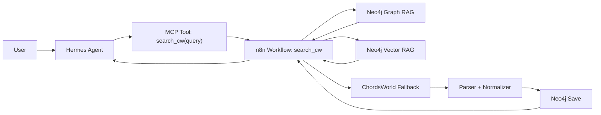

# AI Guitar Song Retrieval Agent

## Problem Formulation

This project builds a bounded AI agent system that helps a guitarist retrieve song chords in a structured and practical way.

The main problem is that chord information on the web is fragmented, inconsistent, and often difficult to reuse in a personalized workflow. Existing chord pages may be incomplete, noisy, or not easily searchable across songs and song structure. A guitarist therefore needs a system that can retrieve existing song data, ingest missing songs when necessary, and return structured chord information through an AI agent interface.

The goal of the system is to let a user ask for a song by title, artist, or ChordsWorld URL and receive a clean song overview with artist, capo, sections, and chord lines. The system must use Hermes Agent as the user-facing agent, MCP as the tool interface, n8n as the workflow engine, Neo4j graph RAG for structured song relationships, and Neo4j vector RAG for semantic retrieval over stored song content.

## Use Case

The chosen use case is a guitar-song retrieval assistant.

The user can:

- ask for chords for a known song
- retrieve a previously stored song from Neo4j
- trigger fallback ingestion when the song is missing
- receive a structured chord overview
- use a reasonable agent interface through Hermes

This is a relevant and bounded use case because it solves a real retrieval problem and uses agents, workflows, tools, graph data, and vector search in a meaningful way.

## Requirements

### Functional Requirements

1. The system must support song retrieval based on a user query.
2. The system must return structured song information including title, artist, capo, and chord sections.
3. The system must search existing project data in Neo4j before using external fallback.
4. The system must ingest and store missing songs from ChordsWorld through an n8n workflow.
5. The system must expose at least one workflow through an MCP-accessible tool so the agent can call it.
6. The system must use Neo4j graph RAG to model and retrieve relationships between songs, artists, and sections.
7. The system must use Neo4j vector RAG to retrieve semantically relevant song content or project data.
8. The system must support user interaction through Hermes Agent as the primary interface.

### Non-Functional Requirements

1. The system must be bounded enough to be implemented as a working prototype.
2. The system must produce readable results for demo and oral presentation.
3. The system should tolerate incomplete or noisy web data.
4. The system should prioritize stable demo behavior over broad feature scope.

## Architecture

### High-Level Description

The user interacts with Hermes Agent. Hermes calls an MCP-exposed tool, which triggers an n8n workflow. The main workflow is `search_cw`, which first queries Neo4j. If the song already exists, it returns the stored result. If not, it falls back to ChordsWorld search, parses the selected song page, stores the result in Neo4j, and returns a formatted song overview.

Neo4j is used in two ways:

- graph RAG for structured retrieval of songs, artists, and sections
- vector RAG for semantic retrieval over stored text content

### Architecture Summary

- `Hermes Agent`
  User-facing agent interface
- `MCP Tool`
  Tool boundary between agent and workflow
- `n8n search_cw`
  Main retrieval and ingestion workflow
- `Neo4j graph RAG`
  Structured lookup of song relationships
- `Neo4j vector RAG`
  Semantic retrieval over project/song content
- `ChordsWorld fallback`
  External source used when the song is missing

### Mermaid Diagram

## Justification Of Platform And Model

Hermes Agent was chosen because it is one of the required platforms and provides a practical agent interface for tool use and orchestration. It allows the system to expose workflows through tools instead of hard-coding all logic inside a single script.

The current model setup uses GitHub Copilot with `gpt-5.3-codex` in Hermes. This model was selected because it worked reliably in the current Hermes setup, while the earlier `gpt-5.5` selection was not supported by the Copilot provider in practice. The selected model is therefore a pragmatic choice based on compatibility and stability rather than maximum capability.

This is relevant to cost and capability reflection:

- larger models may offer stronger reasoning
- but compatibility and operational stability matter in a working prototype
- a stable supported model is more valuable here than a theoretically stronger but failing model

## Student-Created Prompt / Skill

One student-created prompt exists in the `search_cw` tool workflow:

`You are a helpful guitar-song assistant.`

The prompt instructs the system to:

- always use the `search_cw` tool when the user asks about songs, chords, song structure, or provides a ChordsWorld URL
- always pass the full user message as the query parameter
- use the tool result as the single source of truth
- avoid inventing song details, chords, or guitar advice
- present formatted song overviews directly as plain text
- tell the user to paste a ChordsWorld URL if the song is not found

This prompt is important because it constrains hallucination and keeps the system grounded in retrieved data instead of generated guesses.

## Implementation Overview

The main implementation centers on the `search_cw` workflow in n8n.

The workflow:

1. receives the user query
2. normalizes the input
3. queries Neo4j for an existing matching song
4. returns the stored song if found
5. otherwise performs fallback search against ChordsWorld
6. extracts the best candidate URL
7. downloads and parses the page
8. extracts title, artist, capo, and structured sections
9. stores the parsed song in Neo4j
10. formats the final response

This gives the system a meaningful combination of retrieval, ingestion, persistence, and agent-based access.

## Graph RAG

Graph RAG is implemented through Neo4j relationships such as:

- `(:Song)-[:BY_ARTIST]->(:Artist)`
- `(:Song)-[:HAS_SECTION]->(:Section)`

This enables structured retrieval of songs with related artist and section data. Instead of storing only flat text, the system models parts of the musical structure and uses those relationships in retrieval queries.

## Vector RAG

Vector RAG is implemented in Neo4j over stored song-related text or project data. Its purpose is to support semantic retrieval, not just exact title matching.

This means the system can support retrieval based on meaning or similarity rather than only direct string match. In the final report and demo, this should be presented as a separate retrieval mode from the graph lookup.

## Demo Scenarios

### Scenario 1: Song already exists

The user asks for a song that is already stored in Neo4j.

Expected behavior:

- Hermes calls the tool
- the workflow retrieves the song directly from Neo4j
- the system returns structured song output without fallback scraping

### Scenario 2: Song is missing and gets ingested

The user asks for a song not currently stored in Neo4j.

Expected behavior:

- Hermes calls the tool
- Neo4j lookup fails
- the workflow searches ChordsWorld
- the page is parsed and stored
- the final structured song result is returned

### Scenario 3: Semantic retrieval

The user asks for a semantically phrased query supported by the vector layer.

Expected behavior:

- the system uses vector RAG to retrieve relevant stored content
- the response demonstrates that retrieval is not based only on exact title matching

## Known Limitations

1. Web ingestion can produce noisy or malformed records in edge cases.
2. ChordsWorld parsing is useful but not perfect.
3. The system currently prioritizes stable retrieval over advanced personalization.
4. The Discord interface was not prioritized because the CLI/Hermes path was a faster route to a working prototype.
5. The project uses a small dataset, which is acceptable for a bounded prototype but limits coverage.

## Reflection And Future Work

The prototype demonstrates a realistic AI agent system with meaningful integration of Hermes, MCP, n8n, Neo4j graph RAG, and Neo4j vector RAG. Its main strength is that it solves a real retrieval problem through a bounded but working workflow.

Future work could include:

- stronger validation before storing parsed songs
- better cleanup of malformed payloads
- richer personalization of chord preferences
- a Discord or Telegram interface
- broader retrieval over additional chord sources
- improved ranking of candidate song pages

## Safe Demo Query Candidates

- `Find chords for Yellow by Coldplay`
- `Find chords for Blank Space by Taylor Swift`
- `Find chords for Streets of Minneapolis by Bruce Springsteen`
